# 从零测试流程 + 使用说明（含截图）

更新时间：2026-03-06
适用目录：`/home/aris/codeX/log-lottery`

## 1. 环境准备

1. 进入项目根目录：

```bash
cd /home/aris/codeX/log-lottery
```

2. 后端依赖与虚拟环境（首次）：

```bash
cd backend
python3 -m venv .venv
source .venv/bin/activate
pip install -r requirements.txt
cd ..
```

3. 前端依赖（首次）：

```bash
pnpm install
```

## 2. 启动服务

1. 一键启动前后端：

```bash
./scripts/start_all.sh start
```

2. 访问地址：
后端 API：`http://127.0.0.1:8000/api/`
后台管理：`http://127.0.0.1:8000/admin/`
前端页面：`http://127.0.0.1:6719/log-lottery/`

3. 截图（前端登录页）：
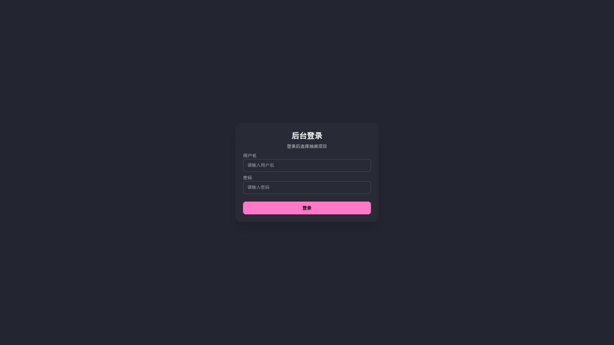

4. 截图（Django Admin 登录页）：
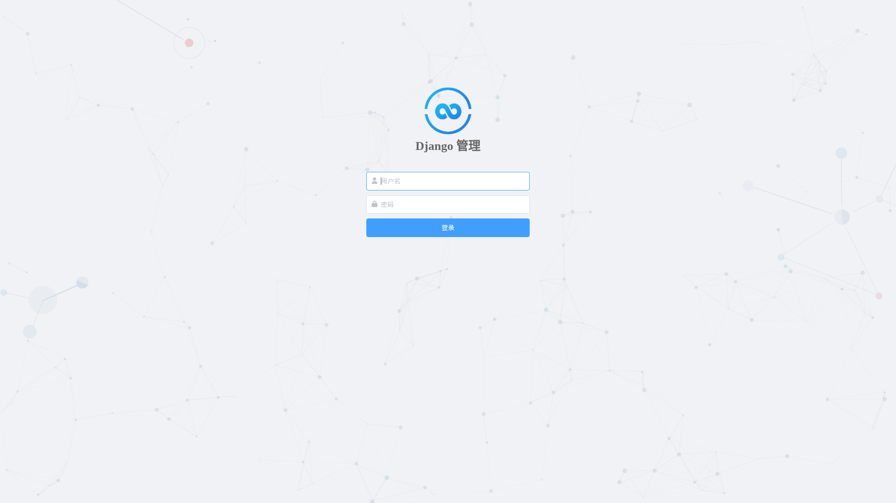

## 3. 后端回归测试（从零）

1. 执行健康检查与迁移检查：

```bash
cd backend
source .venv/bin/activate
python manage.py check
python manage.py makemigrations --check --dry-run
python manage.py showmigrations accounts lottery
cd ..
```

2. 本次结果：
`check` 通过。
`makemigrations --check --dry-run` 提示存在待生成迁移（`accounts` 与 `lottery` 的 Meta options 变更）。
`showmigrations` 显示 `accounts/lottery` 当前已应用到 `0001_initial`。

3. 执行后端权限与隔离测试：

```bash
cd backend
source .venv/bin/activate
python manage.py test apps.lottery.tests.test_api_permissions apps.lottery.tests.test_admin_isolation -v 2
cd ..
```

4. 本次结果：
共 12 个测试，全部通过。

## 4. 前端回归测试（从零）

1. 单元测试：

```bash
pnpm run test -- --run
```

2. 生产构建：

```bash
pnpm run build
```

3. 本次结果：
前端单测 11/11 通过，构建成功。

## 5. 业务链路冒烟（登录->预抽->确认）

1. 执行冒烟脚本（会自动准备 QA 数据并验证主流程）：

```bash
cd backend
source .venv/bin/activate
python manage.py shell -c "from rest_framework.test import APIClient; from apps.accounts.models import Department,AdminUser,UserRole; from apps.lottery.models import Project,Prize,Customer,ProjectMember,DrawWinner; dept,_=Department.objects.get_or_create(code='QA-DEPT',defaults={'name':'QA部门','region':'HZ'}); user,_=AdminUser.objects.get_or_create(username='qa_operator',defaults={'email':'qa@example.com','role':UserRole.SUPER_ADMIN,'department':dept,'is_staff':True,'is_active':True}); user.role=UserRole.SUPER_ADMIN; user.department=dept; user.set_password('Qa123456!'); user.save(); project,_=Project.objects.get_or_create(code='QA-PROJECT-001',defaults={'name':'QA项目','department':dept,'region':'HZ','description':'qa'}); prize,_=Prize.objects.get_or_create(project=project,name='测试奖项',defaults={'sort':1,'is_all':False,'total_count':5,'used_count':0,'separate_count':{},'description':'qa','is_active':True}); c1,_=Customer.objects.get_or_create(phone='13800000001',defaults={'name':'张三'}); c2,_=Customer.objects.get_or_create(phone='13800000002',defaults={'name':'李四'}); ProjectMember.objects.get_or_create(project=project,customer=c1,defaults={'uid':'U001','name':'张三','phone':'13800000001','is_active':True}); ProjectMember.objects.get_or_create(project=project,customer=c2,defaults={'uid':'U002','name':'李四','phone':'13800000002','is_active':True}); client=APIClient(HTTP_HOST='127.0.0.1'); r=client.post('/api/auth/login',{'username':'qa_operator','password':'Qa123456!'},format='json'); print('login_status',r.status_code); data=getattr(r,'data',{}) or {}; token=data.get('token'); print('token_ok',bool(token)); client.credentials(HTTP_AUTHORIZATION=f'Bearer {token}',HTTP_X_PROJECT_ID=str(project.id),HTTP_HOST='127.0.0.1'); r2=client.get('/api/prizes/',{'project_id':str(project.id)}); print('prize_list_status',r2.status_code,'count',len(r2.data) if hasattr(r2,'data') else 'NA'); r3=client.post('/api/draw-batches/preview/',{'project_id':str(project.id),'prize_id':str(prize.id),'count':1},format='json'); print('preview_status',r3.status_code); batch_id=(r3.data or {}).get('id') if hasattr(r3,'data') else None; print('batch_id_ok',bool(batch_id)); r4=client.post(f'/api/draw-batches/{batch_id}/confirm/',{},format='json'); print('confirm_status',r4.status_code); print('confirmed_winners',DrawWinner.objects.filter(batch_id=batch_id,status='CONFIRMED').count())"
cd ..
```

2. 本次结果：
`login_status 200`
`token_ok True`
`prize_list_status 200`
`preview_status 201`
`confirm_status 200`
`confirmed_winners 1`

3. 安全校验（项目头不一致应拒绝）：

```bash
cd backend
source .venv/bin/activate
python manage.py shell -c "from rest_framework.test import APIClient; from apps.accounts.models import AdminUser; from apps.lottery.models import Project,Prize; user=AdminUser.objects.get(username='qa_operator'); project=Project.objects.get(code='QA-PROJECT-001'); prize=Prize.objects.filter(project=project).first(); token=user.auth_token.key; client=APIClient(HTTP_HOST='127.0.0.1'); client.credentials(HTTP_AUTHORIZATION=f'Bearer {token}',HTTP_X_PROJECT_ID='00000000-0000-0000-0000-000000000000',HTTP_HOST='127.0.0.1'); r=client.post('/api/draw-batches/preview/',{'project_id':str(project.id),'prize_id':str(prize.id),'count':1},format='json'); print('mismatch_header_status',r.status_code); print('mismatch_header_body',getattr(r,'data',None))"
cd ..
```

4. 本次结果：
`mismatch_header_status 403`

## 6. 前端使用说明（分步截图）

说明：以下截图全部为本次本机自动化实时截图（目录：`docs/screenshots/2026-03-06-realtime`）。

1. 登录页面（输入账号密码）：


2. 登录后进入项目选择页，选择目标项目：
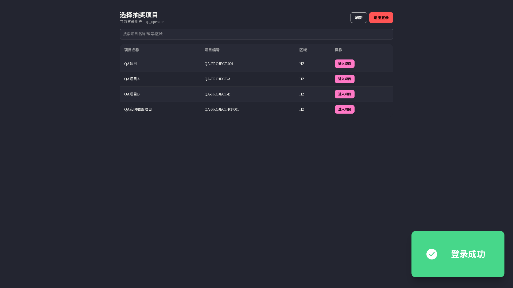

3. 进入首页（抽奖主界面）：
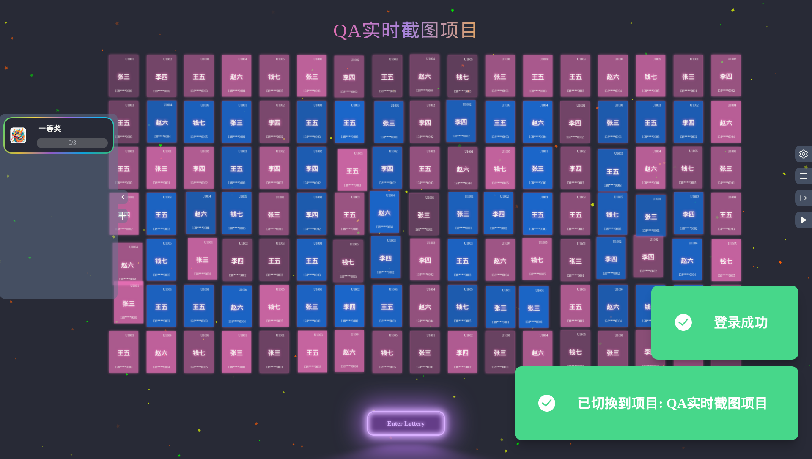

4. 点击“Enter Lottery”进入抽奖准备状态：
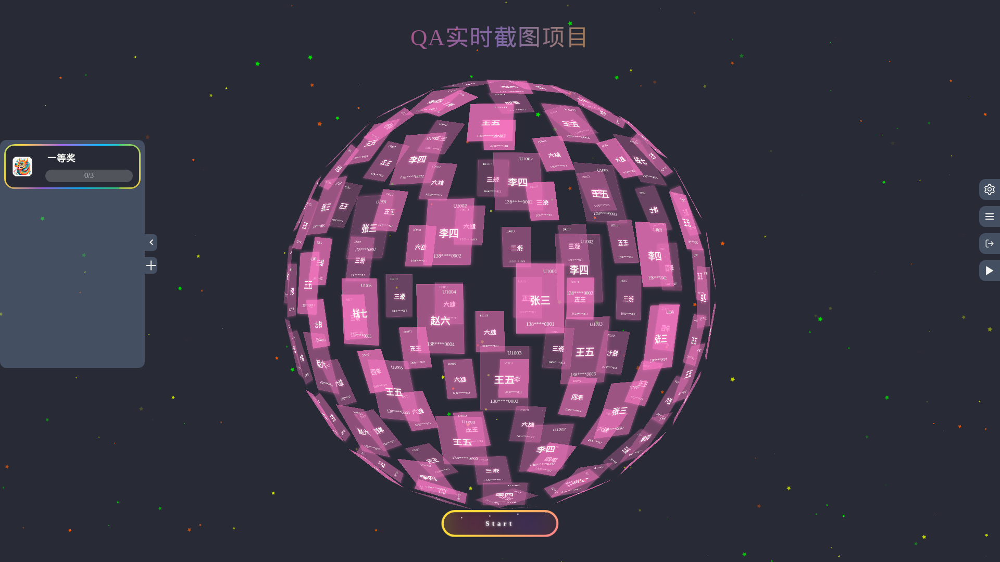

5. 点击“Start”开始抽奖（滚动过程）：
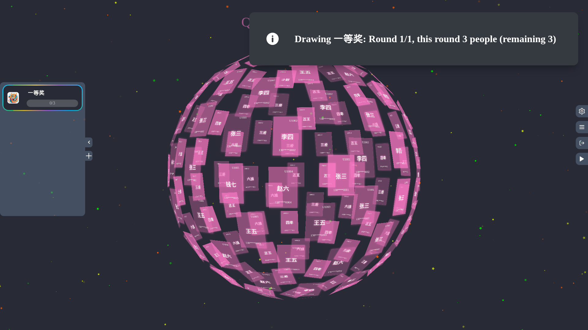

6. 点击“Draw the Lucky”后查看本轮结果：
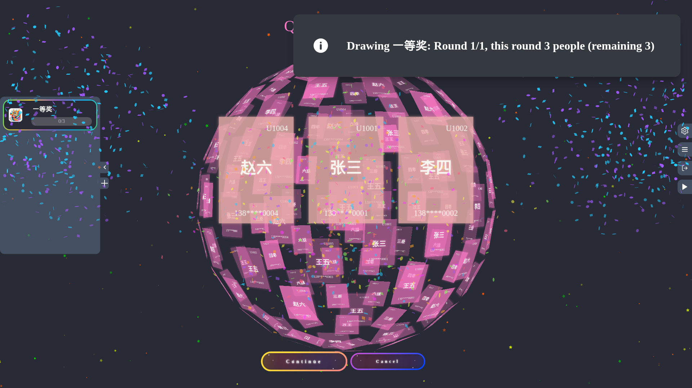

7. 进入人员配置页（成员维护）：
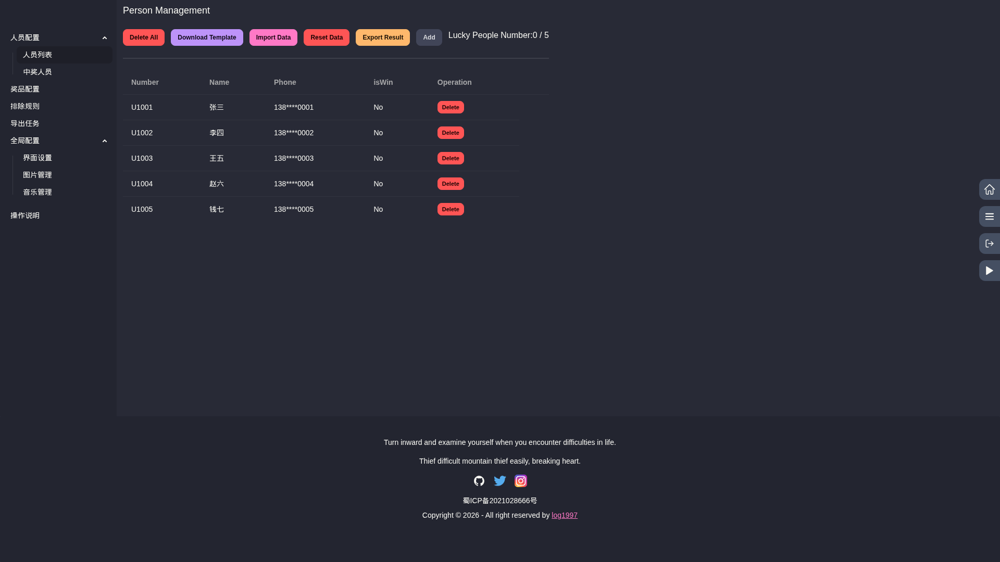

8. 查看中奖人员页：
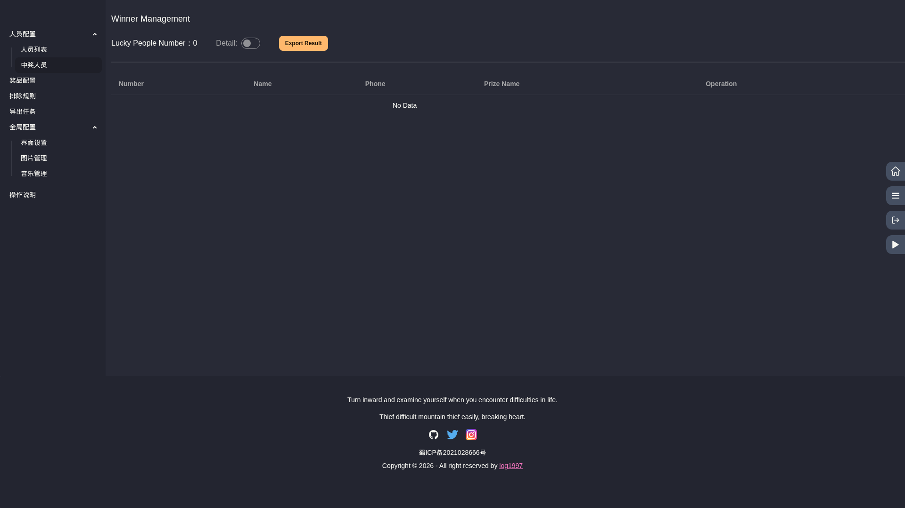

9. 进入奖项配置页：
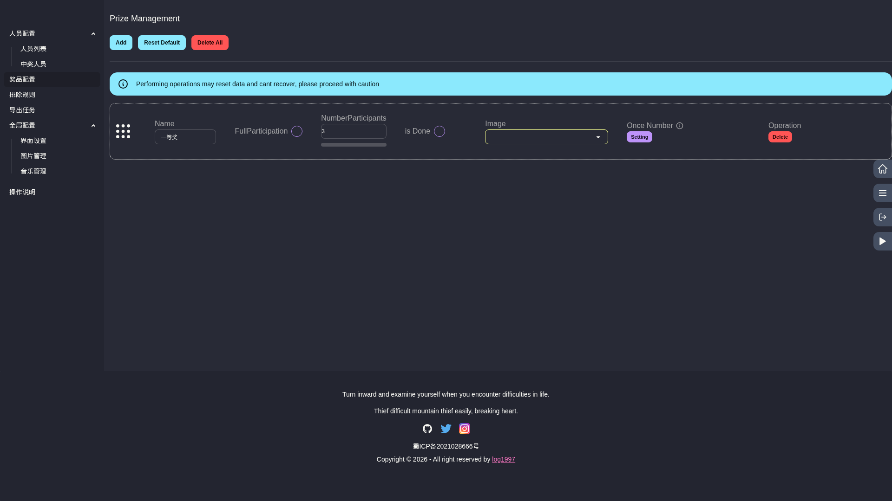

10. 进入排除规则页：
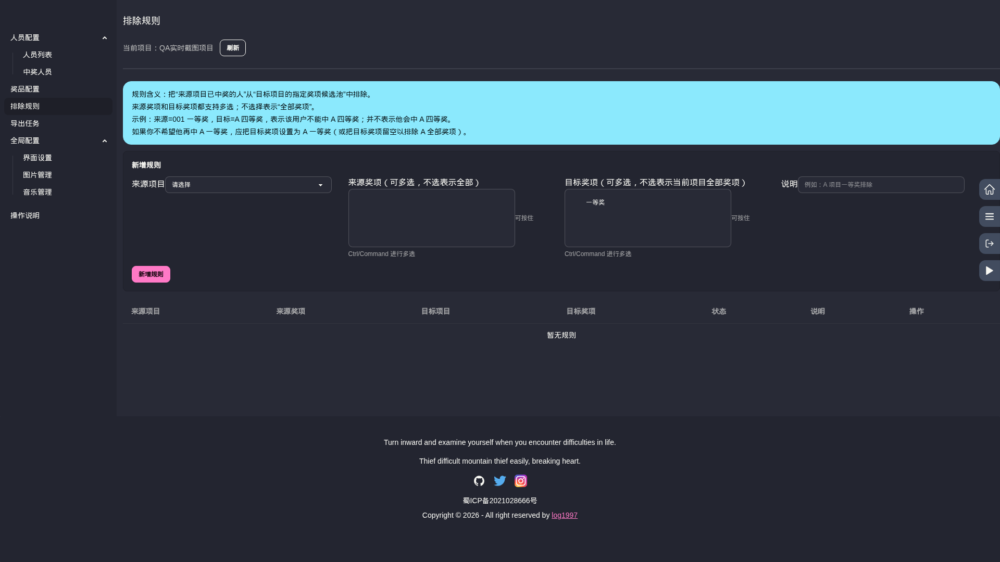

11. 进入导出任务页：
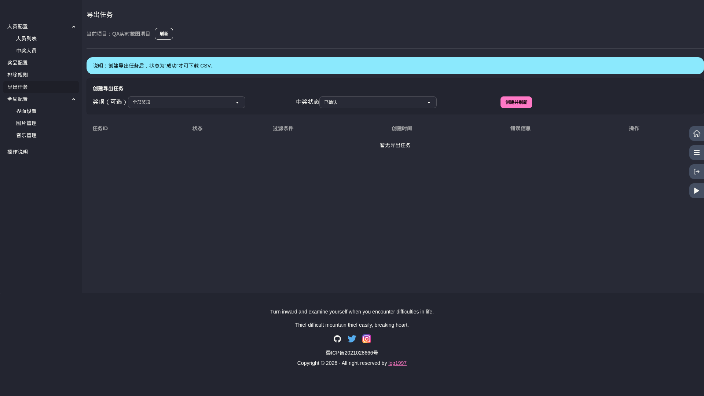

12. 进入界面配置页：
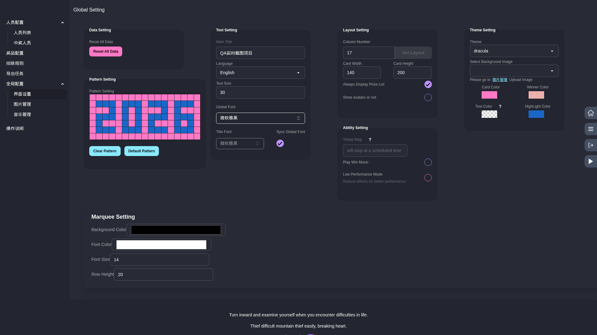

13. 进入图片管理页：
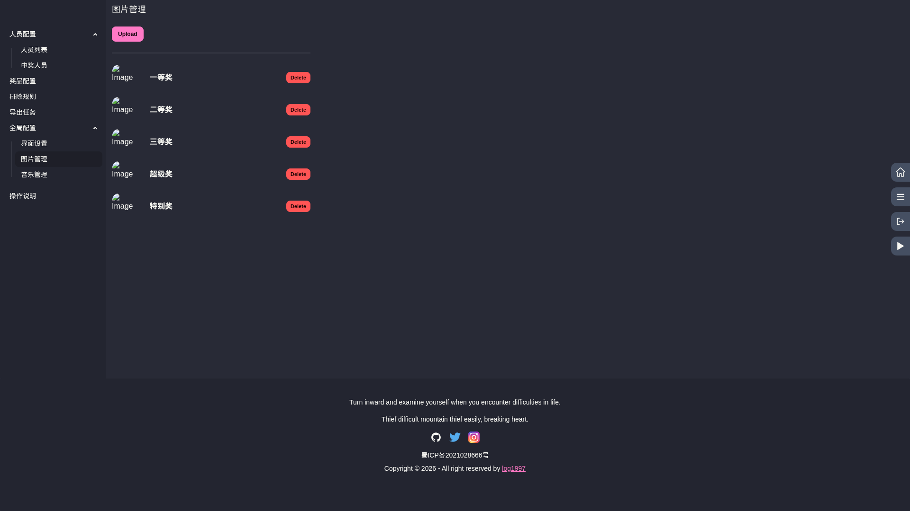

14. 进入音乐管理页：
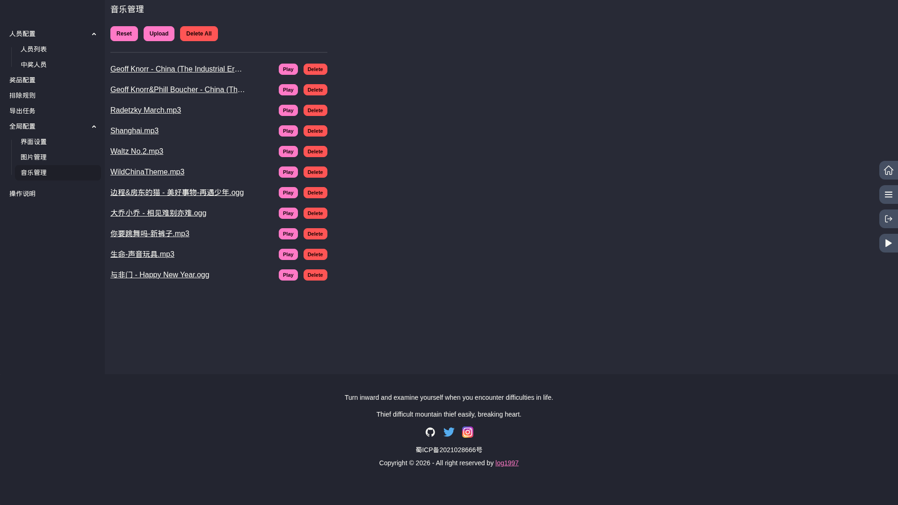

15. 后台管理登录页：


## 7. 一键生成实时截图

1. 启动前后端后执行：

```bash
node scripts/capture_realtime_flow_screenshots.mjs
```

2. 输出目录：
`docs/screenshots/2026-03-06-realtime`

## 8. Admin 管理页截图

1. 执行命令（需后端运行中）：

```bash
node scripts/capture_admin_management_screenshots.mjs
```

2. 输出目录：
`docs/screenshots/2026-03-06-admin`

3. 本次已生成页面：
`01-admin-login.png`
`02-admin-index.png`
`03-admin-department-list.png`
`04-admin-user-list.png`
`05-admin-project-list.png`
`06-admin-member-list.png`
`07-admin-customer-list.png`
`08-admin-prize-list.png`
`09-admin-drawbatch-list.png`
`10-admin-drawwinner-list.png`
`11-admin-exclusion-rule-list.png`
`12-admin-exportjob-list.png`

4. 示例截图（后台首页）：
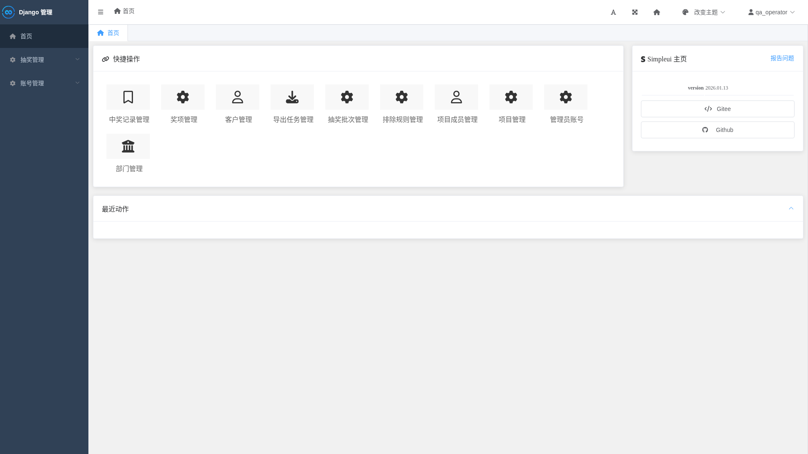

## 9. 停止服务

```bash
./scripts/start_all.sh stop
```
